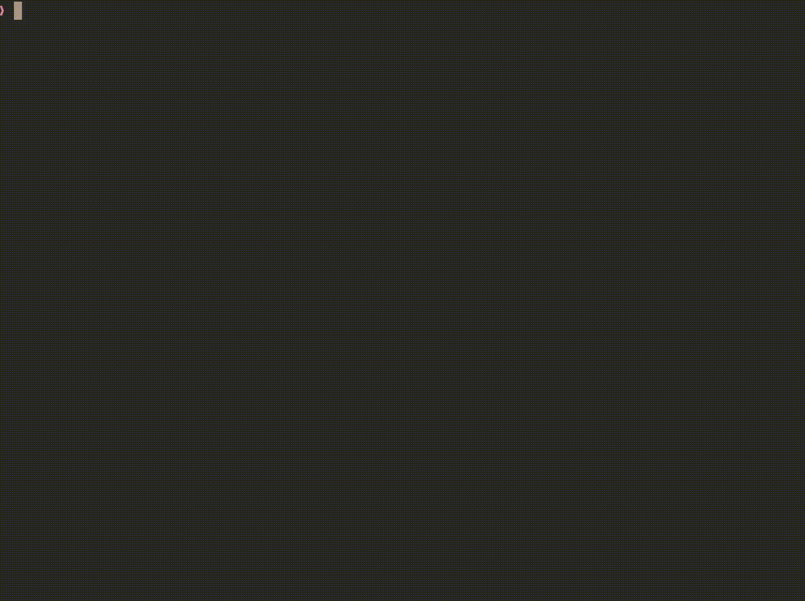

# 🌐 A time zone helper

tz helps you schedule things across time zones. It is an interactive TUI
program that displays time across a few time zones of your choosing.

# Installing

The quickest thing is probably to grab a release, but no one will be
harmed if you build from source.

# Usage

Start tz to show the local time, as well as the UTC time zone. It's
nicer to set the `TZ_LIST` environment variable with a comma-separated
list of [tz data][tzdata] zone names:

[tzdata]: https://en.wikipedia.org/wiki/List_of_tz_database_time_zones

<p align="center">

</p>

# Building

Clone this repository and run:

```
go build .
```

# License

The GPL3 license.

Copyright (c) 2021 Arnaud Berthomier
